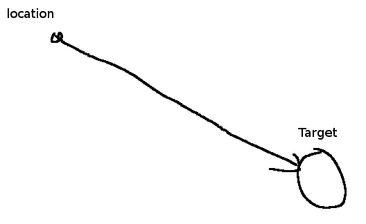

`steering = desired - velocity`



How to calculate desired velocity?
We need to get vector pointing from location do target

```
PVector desired = PVector.sub(target, location)
desired.setMag(maxSpeed)

PVector steering = PVector.sub(desired, velocity)
applyForce(steering)
steering.limit(maxForce)
```

